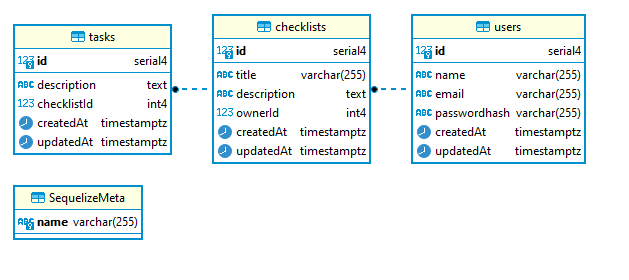
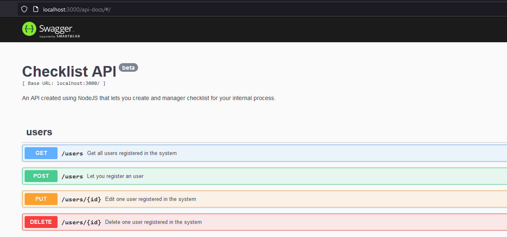

# 📝 Checklist Backend API 
## Introduction
An Restful API using NodeJS that lets you create and manage checklist for your internal process.

### What i'm trying to learn with this project
- How to better structure folders for clean project
- How to write tests when developing

### Planned Features
- [X] Able to create, view, modify and delete user.
- [ ] Able to create multiple checklist.
- [ ] Able to authenticate users.
- [ ] Able to create multiple kinds of tasks for checklist, for example: closed questions and open questions.

## Database schema

## Creating development environment
### Create database
- Install [Docker](https://www.docker.com/)
- Run the folowing command `docker pull postgres` to download PostgreSQL image
- Execute `docker run --name bd_dev -e "POSTGRES_PASSWORD=YOUR_PASS" -p 5432:5432 -d postgres` and change YOUR_PASS with the password for database.
- Now the database is accessible from port 5432 on your local machine, if you want to access the container just type: `docker exec -it bd_dev bash`

### Running the application
- Install LTS version of [NodeJS](https://nodejs.org/en/)
- Inside the folder run `npm install`
- To build the schema on the database we need to run the migrations with `npx sequelize-cli db:migrate`
- Then lets run the tests with `npm run test`
- Now to run the application just type `npm run start`
- You can access the documentation on path `/api-docs` for example `http://localhost:3000/api-docs`

